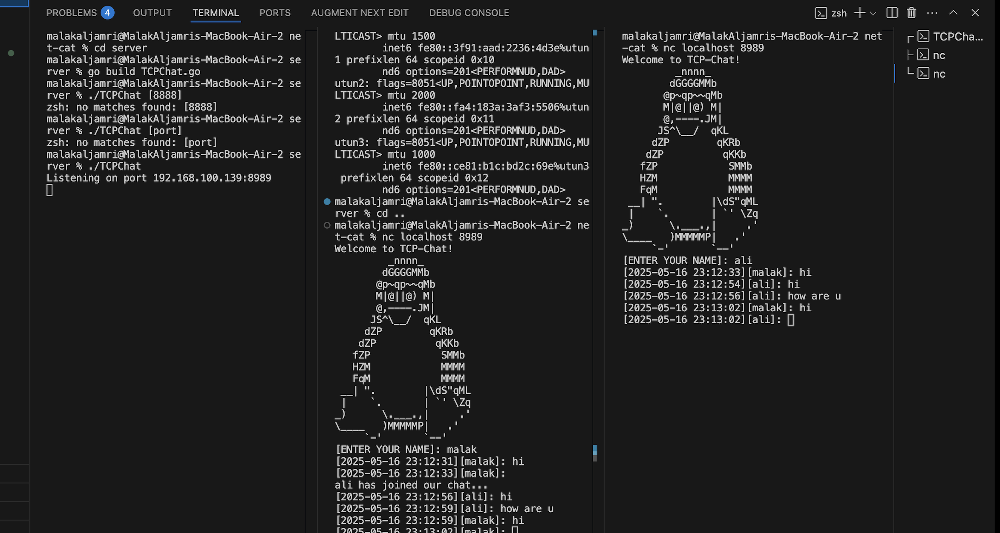

# TCP-Chat (NetCat Clone)

## Description
TCP-Chat is a command-line utility designed to facilitate real-time messaging over TCP connections in a server-client architecture. It mimics the functionality of NetCat (nc) but focuses specifically on enabling group chat functionalities across multiple clients connected to a central server.

## Usage
To run TCP-Chat, ensure you are using a Linux bash terminal and follow these steps:

1. **Server Mode**: Build and start the server on a specified port to listen for incoming connections.
   ```bash
   $ cd server
   $ go build TCPChat.go
   $ ./TCPChat [port]

2. **Client Mode**: Connect to the server using the provided IP address and port.
   ```bash
   $ cd .. to get back from the server folder
   nc locathost [port]
   Example:
   nc 127.0.0.1 8080
   or 
   nc your ip 8080
   ```

## Changing Username

Users can change their username using the `/name` command within the chat session. Here’s how it works:

- **Command Format**: To change your username, type `/name new_username` and press Enter.

- **appendix**



